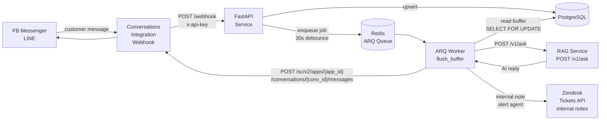
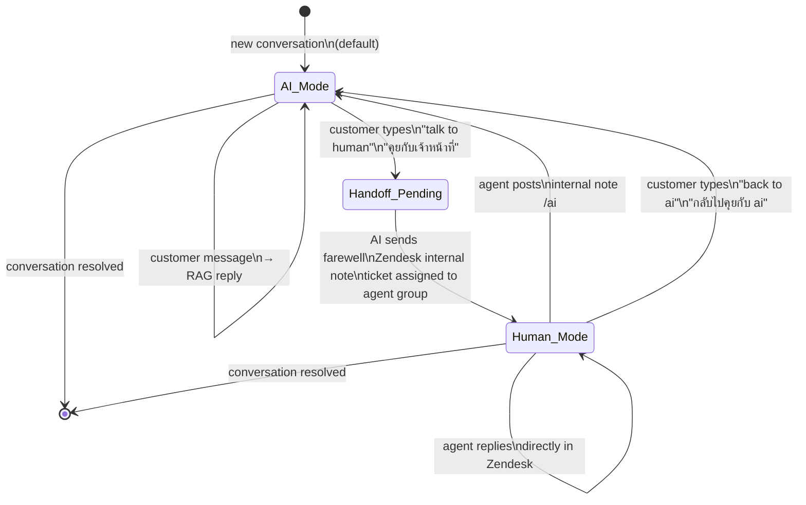
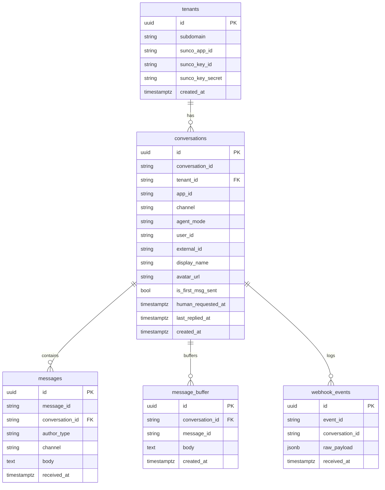
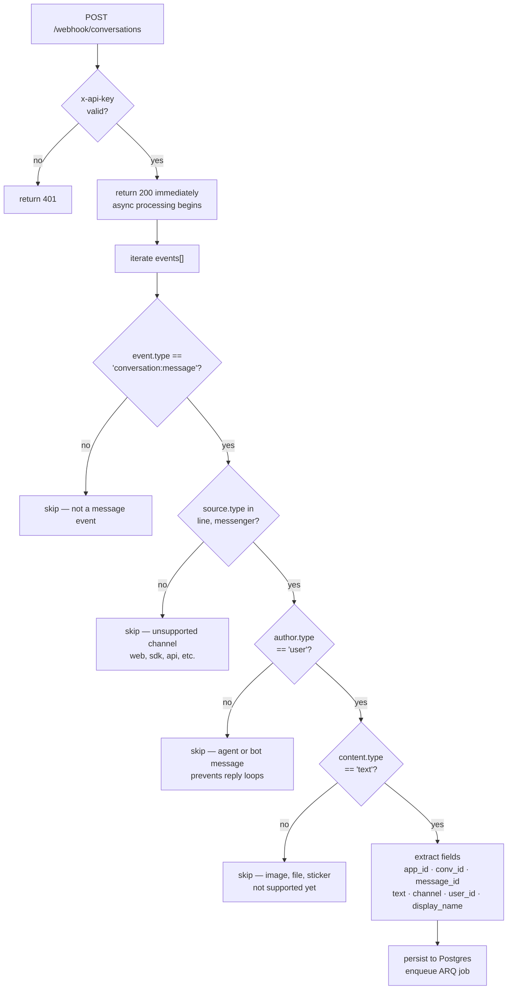
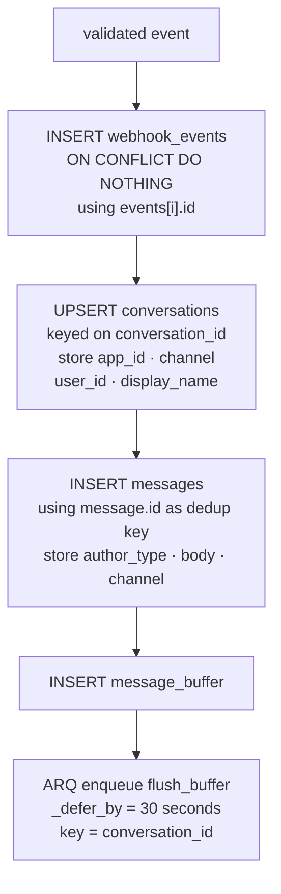
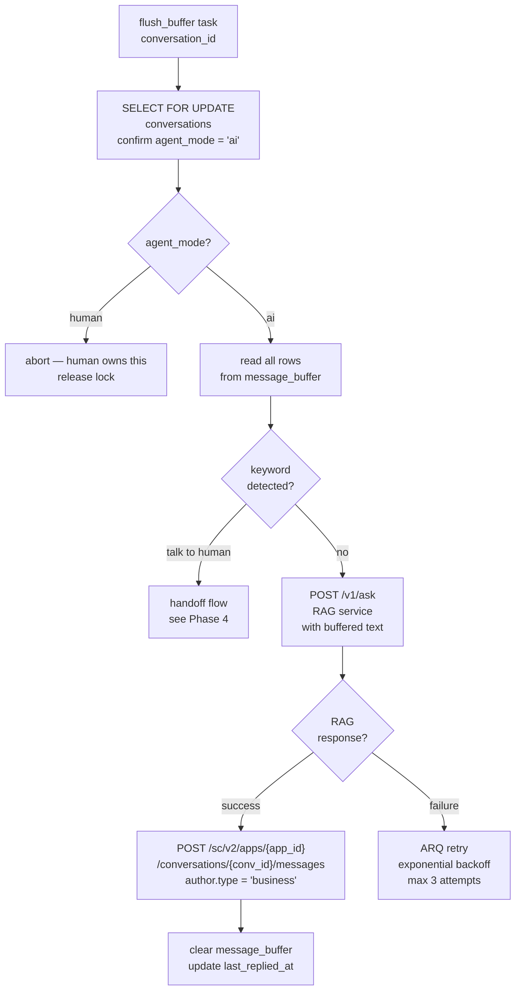
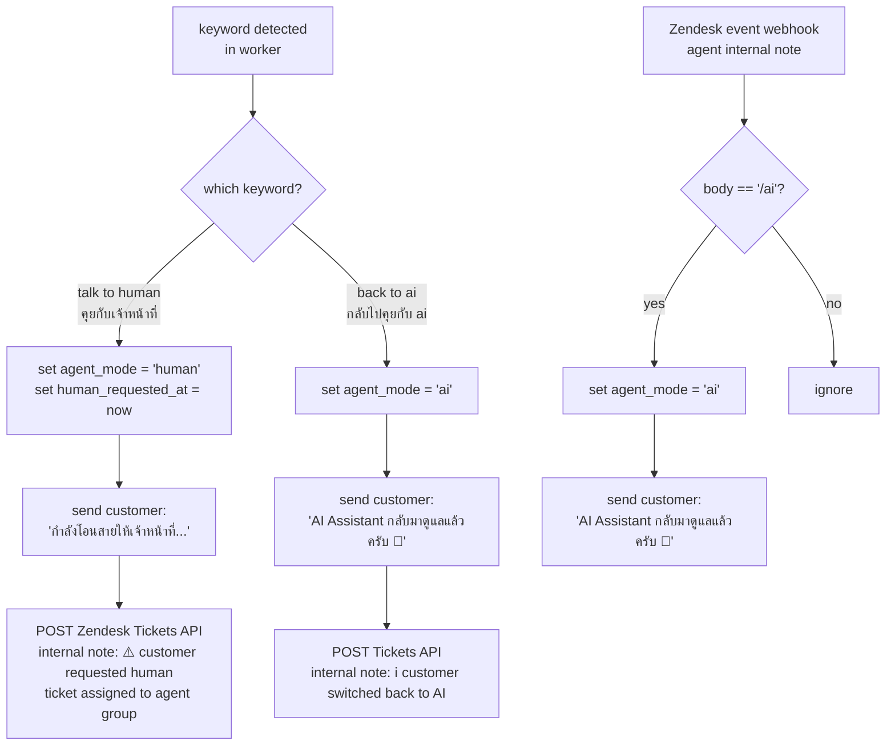

# Zendesk AI Agent Service — Implementation Plan
**Version 1.1 | Stack: FastAPI · asyncpg · ARQ · Redis · PostgreSQL**

---

## Overview

This service receives customer messages from Facebook Messenger and LINE via the Zendesk **Conversations Integration** webhook, processes them through a custom RAG service, and replies back through the Conversations API. It manages a full AI ↔ Human agent state machine per conversation.

---

## System Architecture



---

## Agent Mode State Machine



---

## Webhook Payload Reference

Incoming payload from Conversations Integration (full enriched format with `client` details):

```json
{
  "app": { "id": "69b431da2a58376b846eb50e" },
  "webhook": { "id": "69b4b35b1f8f194414dbb9d2", "version": "v2" },
  "events": [
    {
      "id": "69b4c5f014137ce0cd455f09",
      "createdAt": "2026-03-14T02:20:32.440Z",
      "type": "conversation:message",
      "payload": {
        "conversation": {
          "id": "69b43c86543fa6363b8fabe1",
          "type": "personal",
          "brandId": "55988942245529",
          "activeSwitchboardIntegration": {
            "id": "69b431db701f816b35d0929e",
            "name": "zd-agentWorkspace",
            "integrationId": "69b431da02e3021a49370df2",
            "integrationType": "zd:agentWorkspace"
          }
        },
        "message": {
          "id": "69b4c5f014137ce0cd455eec",
          "received": "2026-03-14T02:20:32.440Z",
          "author": {
            "userId": "69b43c86543fa6363b8fabdd",
            "displayName": "usurachai",
            "type": "user",
            "user": {
              "id": "69b43c86543fa6363b8fabdd",
              "authenticated": false
            }
          },
          "content": {
            "type": "text",
            "text": "แล้ว line ละ"
          },
          "source": {
            "type": "line",
            "integrationId": "69b435b5b021be8c65fe5bf3",
            "originalMessageId": "605025881873973844",
            "client": {
              "integrationId": "69b435b5b021be8c65fe5bf3",
              "type": "line",
              "externalId": "U5a219ff810696d2490792ff7ffa2ecb9",
              "id": "69b43c86543fa6363b8fabde",
              "displayName": "usurachai",
              "status": "active",
              "raw": {
                "userId": "U5a219ff810696d2490792ff7ffa2ecb9",
                "displayName": "usurachai",
                "language": "en"
              },
              "lastSeen": "2026-03-14T02:20:32.408Z",
              "linkedAt": "2026-03-13T16:34:14.694Z",
              "avatarUrl": "https://sprofile.line-scdn.net/..."
            }
          }
        }
      }
    }
  ]
}
```

**Key field mappings:**

| Field path | Usage |
|---|---|
| `app.id` | App ID for Conversations API replies |
| `events[i].id` | Idempotency key → `webhook_events` table |
| `events[i].payload.conversation.id` | Conversation key → debounce, buffer, reply |
| `events[i].payload.message.id` | Dedup key → `messages` table |
| `events[i].payload.message.author.type` | Must be `"user"` — filter out agent/bot |
| `events[i].payload.message.author.userId` | External user ID — store per conversation |
| `events[i].payload.message.author.displayName` | Customer display name |
| `events[i].payload.message.content.type` | Must be `"text"` — ignore image/file events |
| `events[i].payload.message.content.text` | Message body → RAG input |
| `events[i].payload.message.source.type` | **Channel filter** — only process `"line"` or `"messenger"` |
| `events[i].payload.message.source.client.externalId` | LINE userId / FB PSID — store for analytics |
| `events[i].payload.message.source.client.displayName` | Channel-specific display name |
| `events[i].payload.message.source.client.avatarUrl` | Customer avatar — optional, store if needed |

### Source type filter — allowed channels

Only the following `source.type` values are processed. All others are silently dropped with a `200` response:

```python
ALLOWED_CHANNELS = {"line", "messenger"}
```

Possible values that must be **rejected**: `"api"`, `"api:conversations"`, `"web"`, `"sdk"`, `"zd:agentWorkspace"`, and any other string not in the allowed set. This prevents your service from accidentally processing messages from web widgets, SDK channels, or agent replies injected via API.

---

## Database Schema



### `agent_mode` values

| Value | Meaning |
|---|---|
| `ai` | Default. Worker calls RAG and replies automatically |
| `human` | Worker is fully silent. Human agent owns the conversation |

---

## Phase 1 — Webhook Receiver + Auth



**Implementation tasks:**

- `POST /webhook/conversations` — entry point for all Conversations Integration events
- Verify `x-api-key` header against `CONVERSATIONS_WEBHOOK_SECRET` env var — return `401` if invalid
- Return `HTTP 200` immediately before async work — Conversations Integration retries on non-200
- Iterate over `events[]` — a single POST can contain multiple events
- Filter 1: skip if `event.type != "conversation:message"`
- Filter 2: skip if `source.type not in {"line", "messenger"}` — drop web, sdk, api channels
- Filter 3: skip if `author.type != "user"` — prevents AI reply loops from agent/bot messages
- Filter 4: skip if `content.type != "text"` — ignore image, sticker, file events for now
- Extract and pass to Phase 2: `app_id`, `conversation_id`, `message_id`, `text`, `channel`, `user_id`, `display_name`, `avatar_url`

---

## Phase 2 — Postgres Persistence + ARQ Enqueue



**Implementation tasks:**

- `webhook_events` insert with `ON CONFLICT DO NOTHING` using `events[i].id` as idempotency key
- `conversations` upsert — store `app_id`, `channel`, `user_id` (`source.client.externalId`), `display_name` — all needed for reply and analytics
- `messages` insert with `message.id` as dedup key, store `channel` per message for audit trail
- `message_buffer` insert — accumulates all messages within the 30-second debounce window
- ARQ enqueue `flush_buffer(conversation_id)` with `_defer_by=timedelta(seconds=30)`
- If a job for this `conversation_id` already exists in the queue, ARQ deduplicates automatically

---

## Phase 3 — ARQ Worker: RAG Call + Conversations API Reply



**Implementation tasks:**

- `SELECT FOR UPDATE` on `conversations` — prevents race if two workers run for same conversation
- Read and concatenate all `message_buffer` rows for context
- Keyword detection before RAG — check `HANDOFF_KEYWORDS` list (Thai + English)
- If first message (`is_first_msg_sent = false`) — prepend AI disclaimer to reply
- RAG call: `POST {RAG_BASE_URL}/v1/ask` with `{"query": "<buffered text>", "conversation_id": "..."}`
- Reply via Conversations API: `POST https://{subdomain}.zendesk.com/sc/v2/apps/{app_id}/conversations/{conv_id}/messages`
- Auth: Basic auth with `SUNCO_KEY_ID:SUNCO_KEY_SECRET`
- On success: clear buffer, flip `is_first_msg_sent = true`, update `last_replied_at`
- On failure: raise exception — ARQ handles retry with exponential backoff

---

## Phase 4 — AI ↔ Human Handoff



### Handoff keyword list

```python
HANDOFF_KEYWORDS = [
    "talk to human", "human agent", "real person",
    "คุยกับเจ้าหน้าที่", "ขอคุยกับคน", "คุยกับคน",
    "โอนสาย", "พนักงาน"
]

RETURN_TO_AI_KEYWORDS = [
    "back to ai", "ai agent", "use ai",
    "กลับไปคุยกับ ai", "คุยกับ ai", "ให้ ai ตอบ"
]
```

### Agent handback via internal note

Agents never need a separate tool — they post `/ai` as an internal note inside Zendesk.
The Zendesk event webhook fires, FastAPI detects `actor.type == "agent"` and `body.strip() == "/ai"`,
flips `agent_mode = 'ai'`, and the AI resumes on the next customer message.

### REST override endpoint

For programmatic or dashboard-based control:

```
POST /handoff/{conversation_id}/human
POST /handoff/{conversation_id}/ai
GET  /handoff/{conversation_id}/status
```

---

## Phase 5 — Debug Tooling + Docker Compose

**Debug endpoints (non-production only):**

```
GET  /debug/postgres          — full table state dump
GET  /debug/redis             — pending ARQ jobs and queue depth
GET  /debug/conversation/{id} — single conversation full state
```

**Docker Compose services:**

```yaml
services:
  api:
    build: .
    command: uvicorn app.main:app --host 0.0.0.0 --port 8000
    environment:
      - DATABASE_URL=postgresql://...
      - REDIS_URL=redis://host.docker.internal:6379
      - CONVERSATIONS_WEBHOOK_SECRET=...
      - SUNCO_KEY_ID=...
      - SUNCO_KEY_SECRET=...
      - RAG_BASE_URL=...
      - ZENDESK_SUBDOMAIN=kasikornbankgroup
      - ZENDESK_API_TOKEN=...
      - ZENDESK_AGENT_GROUP_ID=...

  worker:
    build: .
    command: python -m app.worker
    environment:
      - DATABASE_URL=postgresql://...
      - REDIS_URL=redis://host.docker.internal:6379
      - SUNCO_KEY_ID=...
      - SUNCO_KEY_SECRET=...
      - RAG_BASE_URL=...
```

PostgreSQL and Redis run locally — both services connect via `host.docker.internal`.

---

## Environment Variables Reference

| Variable | Usage |
|---|---|
| `CONVERSATIONS_WEBHOOK_SECRET` | Validate `x-api-key` on incoming webhook |
| `SUNCO_KEY_ID` | Conversations API Basic auth username |
| `SUNCO_KEY_SECRET` | Conversations API Basic auth password |
| `RAG_BASE_URL` | Base URL for RAG service |
| `ZENDESK_SUBDOMAIN` | `kasikornbankgroup` |
| `ZENDESK_API_TOKEN` | For posting internal notes via Tickets API |
| `ZENDESK_AGENT_GROUP_ID` | Group to assign ticket on human handoff |
| `DATABASE_URL` | asyncpg PostgreSQL connection string |
| `REDIS_URL` | ARQ Redis connection string |

---

## Build Order

```mermaid
gantt
    title Implementation phases
    dateFormat X
    axisFormat Phase %s

    section Core
    Phase 1 — Webhook receiver     :p1, 0, 1
    Phase 2 — Persistence + enqueue :p2, 1, 2
    Phase 3 — Worker + RAG + reply  :p3, 2, 3

    section Handoff
    Phase 4 — AI/Human state machine :p4, 3, 4

    section Ops
    Phase 5 — Debug + Docker Compose :p5, 4, 5
```


